# PiezoKeys

A 4-key USB-MIDI keyboard using piezo discs for keystroke detection, with a laser-cut faceplate, 3D printed case, and an RGBW LED under each key. It's kinda like a stenographer's keyboard but for music: 4 keys allow you to play 15 different notes, depending on which keys you hit. You can set a root note, scale and transposition (up to +/- 2 octaves) in a small menu. 

<p align="center">
  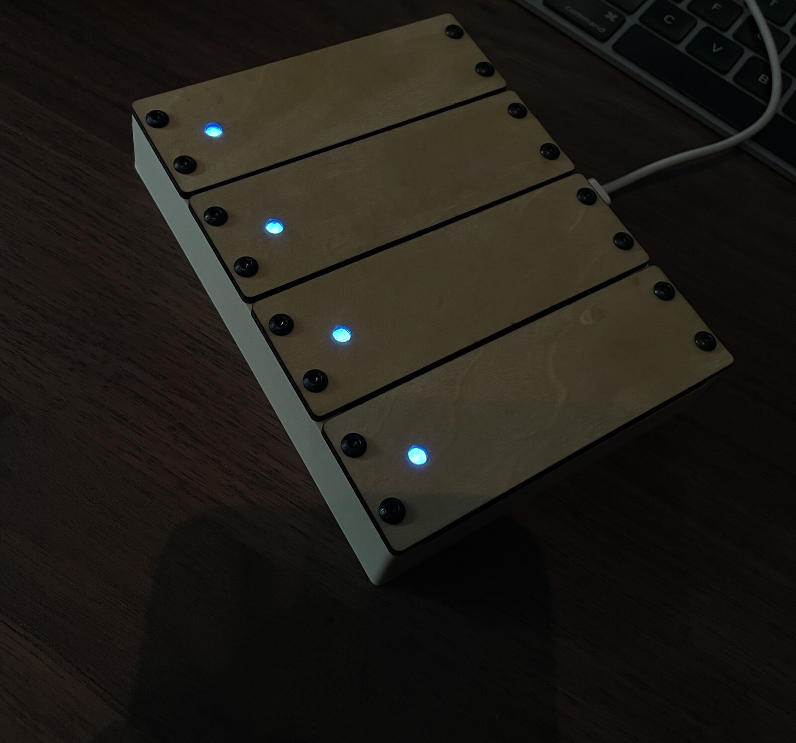
  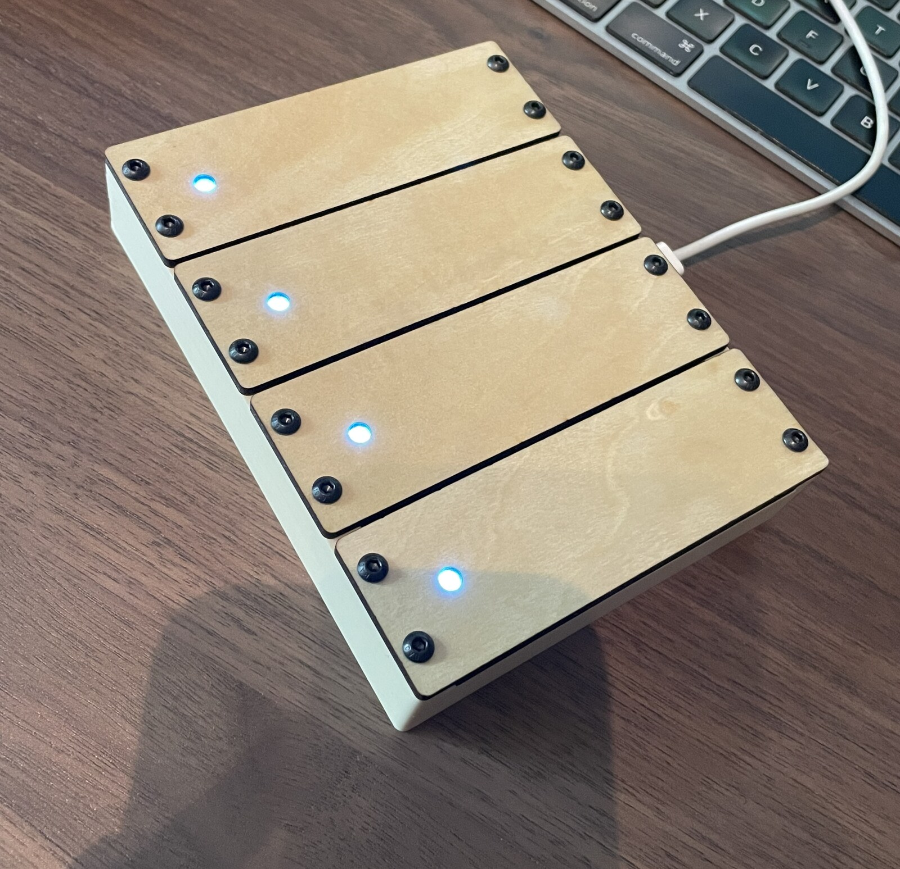
</p>

Runs on a Seeed XIAO RP2040 and shows up as a class-compliant USB MIDI device. You could also easily add a TRS MIDI Out circuit to use it with hardware synths.

### Two things you should know before you build this

**The firmware is AI-written.** I'm not a programmer, I came up with the idea, developed the keystroke and menu logic and designed the 3D models, with Claude Code doing the actual coding. It works and it's been play-tested and tuned for some time, but check the code for yourself instead of blindly trusting, and if you find something dumb, open an issue or a PR.

**Key 1 and Key 4 are less sensitive than 2 and 3.** They sit right against the outer walls of the case, which are stiffer than the inner walls, so the same tap produces a weaker signal. Software compensates with lower trigger thresholds on those two, and it's somewhat fine — but if you want to fix it properly, add one dummy/blank key on each end of the case so 1 and 4 become "inner" keys too. 

Massive credit to [**ellitone.usa**](https://www.instagram.com/ellitone.usa/) on Instagram — this whole project exists because I saw what they were doing with piezos and picked their brain about it. And their stuff looks and sounds even better than mine xD

---

## Contents

- [Bill of Materials](#bill-of-materials)
- [3D print & laser files](#3d-print--laser-files)
- [Assembly](#assembly)
- [Flashing the firmware](#flashing-the-firmware)
- [How to play it](#how-to-play-it)
- [Prototyping sketch](#prototyping-sketch)
- [License](#license)

---

## Bill of Materials

| Part | Qty | Notes |
|---|---|---|
| [USB-C breakout panel (4 or 6 pin)](https://de.aliexpress.com/item/1005005993405905.html) | 1 | Mounts in the case wall |
| [USB-C plug breakout, **male**](https://de.aliexpress.com/item/1005006026634212.html) | 1 | Remove any resistors on this one — see wiring below |
| [27–28mm piezo disc](https://de.aliexpress.com/item/1005009297969587.html) | 4 | Smaller might work too, haven't tried it |
| [SK6812 RGBW breakout, individual pixel](https://de.aliexpress.com/item/1005001527124508.html) | 4 | A cuttable strip works too, other addressable LEDs probably work with a code tweak |
| M3 heat-press insert | 16 | |
| M3x6mm screw | 16 | Longer is fine, up to 10-12mm |
| M2x6mm screw | 2 | Hold the USB-C panel jack in place |
| M2 standoff or nut | 2 | Hold the USB-C panel jack in place |
| Seeed XIAO RP2040 | 1 | Has USB-C (with MIDI capability) + 4 ADC pins, which you need all of. The RP2350 version only has 3 ADCs and won't work here |
| 620Ω resistor (600–700Ω range fine) | 4 | Pulldown for each piezo. Wider range works but you may need to retune thresholds in firmware or lose velocity sensitivity |
| Felt or rubber feet | 4 | I used 18mm felt pads meant to be put under furniture |

## 3D print & laser files

<p align="center">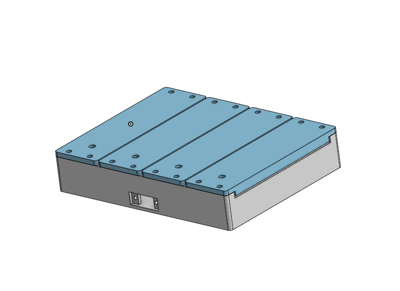</p>

Everything's in [`hardware/`](hardware):

- **`hardware/3d-print/`** — `case.stl` (mine printed fine without supports, though tree supports near the USB cutout make it a little cleaner), `led_lens.stl` × 4 (clear filament, no supports needed, print with the square recess on the buildplate), `feet_spacer.stl` (helps align whatever felt or rubber feet you have evenly) and optionally `key.stl` (the actual keys, if you don't have access to a laser. **Haven't tested these, let me know if/how well they work**).
- **`hardware/laser-cut/`** — two DXF files (`piezo-keyarray-cut.dxf` for the cuts, 
`piezo-keyarray-engrave.dxf` for the engraving) plus the source `.ai` files. Cut on a Creality Falcon A1 (30×30cm bed). I had some troubles getting them aligned properly in FalconDesignSpace, make sure the engrave lines are evenly spaced between the top and bottom mounting holes on the front piece. If your laser has a smaller working area, you'll need to tile them yourself or cut in batches.

Each key is two laser-cut layers glued together: a larger front piece (with alignment lines engraved on the back) and a smaller back piece with the cutouts for the piezo and LED lens.

## Assembly

<p align="center">
  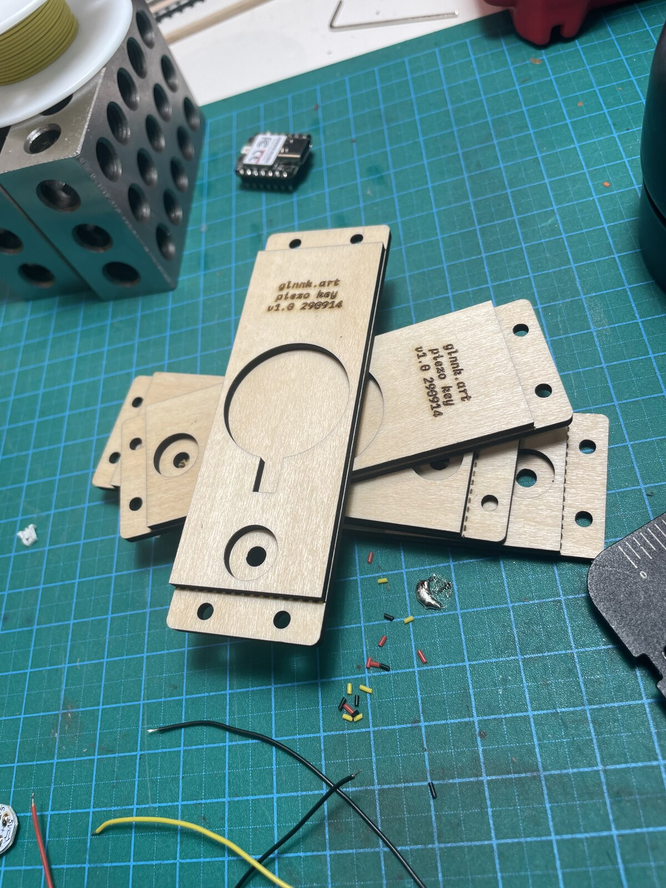
  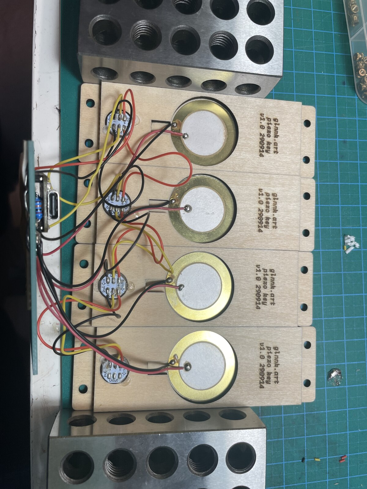
  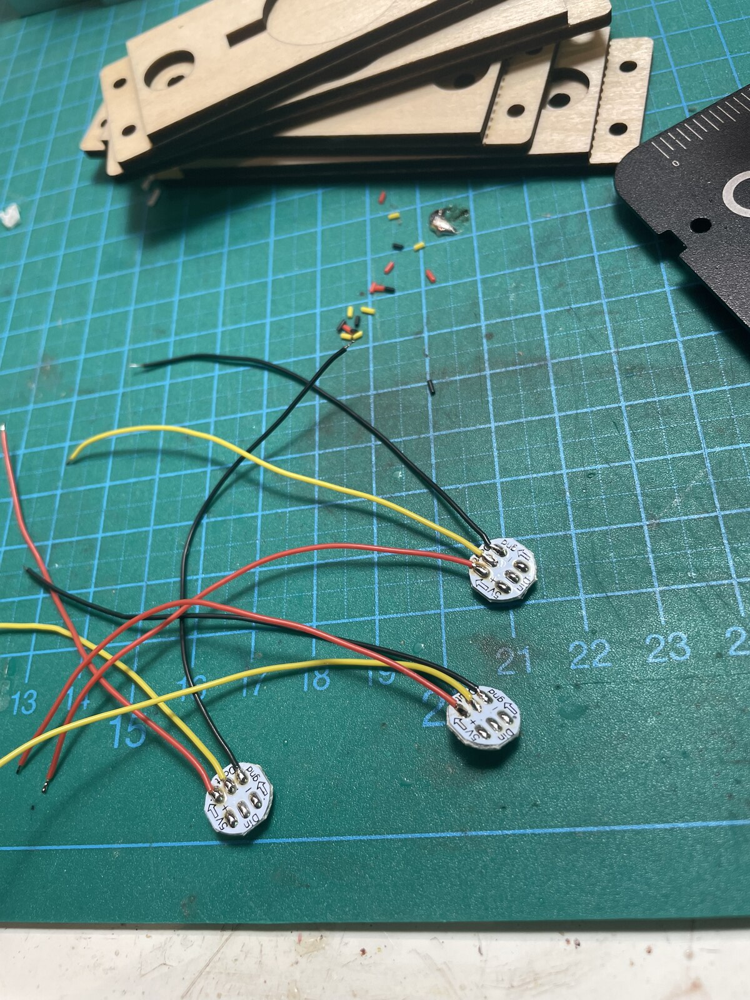
</p>

**Gluing the keys:** wood glue for the two laser-cut layers of each key, with the LED lens sitting in place while it dries to keep everything aligned; leave it to dry overnight. For the LED lens itself and the LED pixels, I used Aileen's Tacky Glue, but probably any glue works; if you go with super glue, use a gel version so it fills gaps. For a next build I'd probably just hot-glue the whole thing.

**Gluing the piezos:** gel super glue, golden side down into the cutout. Lightly sand the piezo first so the glue has something to grip.

<p align="center">
  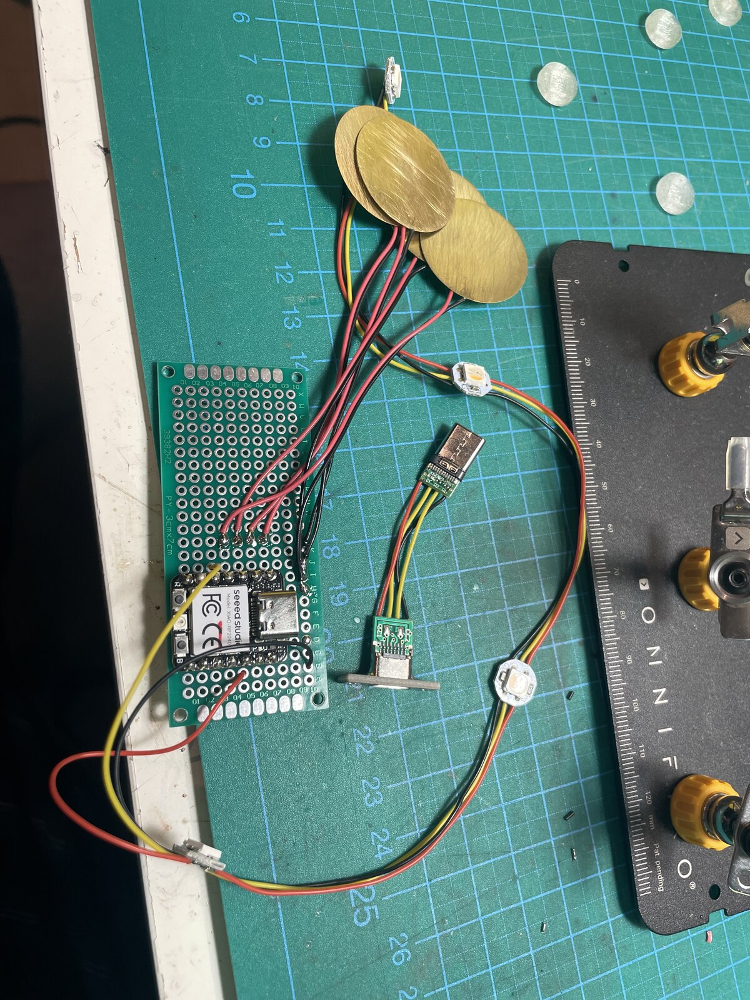
  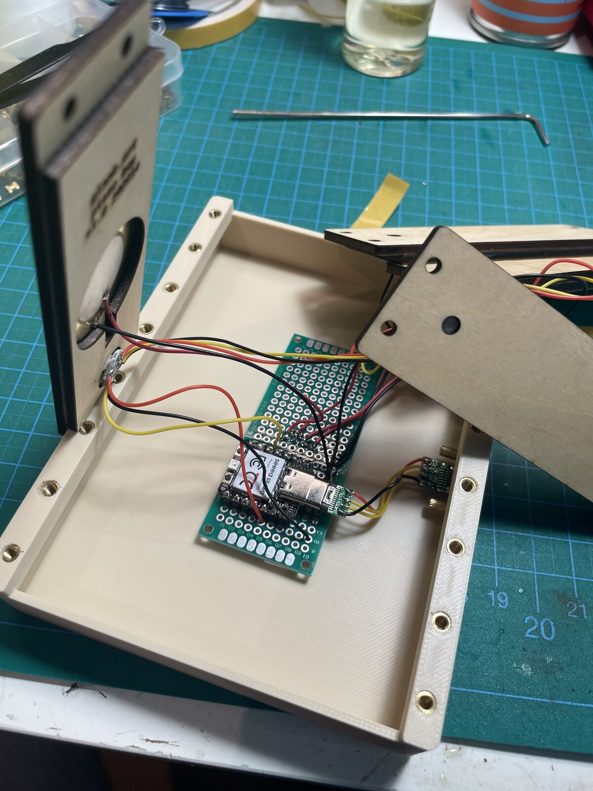
  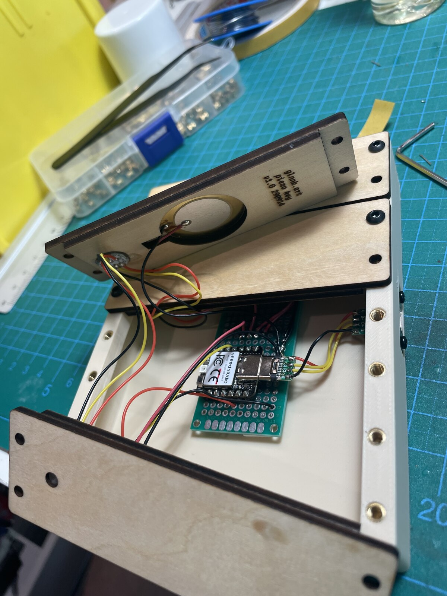
</p>

**Wiring:**

- Piezos → `A0`–`A3` on the XIAO, key 1 = `A0`. Each piezo needs its resistor wired between the ADC pin and GND as a pulldown.
- LEDs are daisy-chained (Dout → Din) and the chain's data-in goes to pin `D4`. On my build the physical first LED in the chain ended up sitting on key 4, i.e. wired backwards relative to key order — I just flipped that in software (see `KEY_TO_LED` in `firmware/src/main.cpp`) instead of re-wiring. LEDs are rated for 5V but run fine off the board's 3.3V.
- USB-C: the breakout that plugs into the RP2040 has resistors on it from the factory — pull those off, keep only the two 5.1K on the panel-mount side. Wire GND–GND, 5V–5V, D+–D+, D−–D−.

<p align="center">
  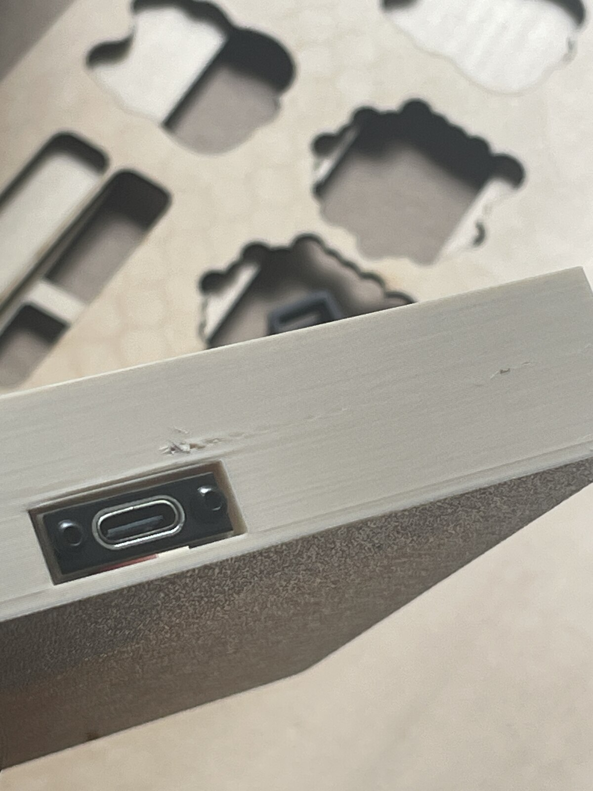
  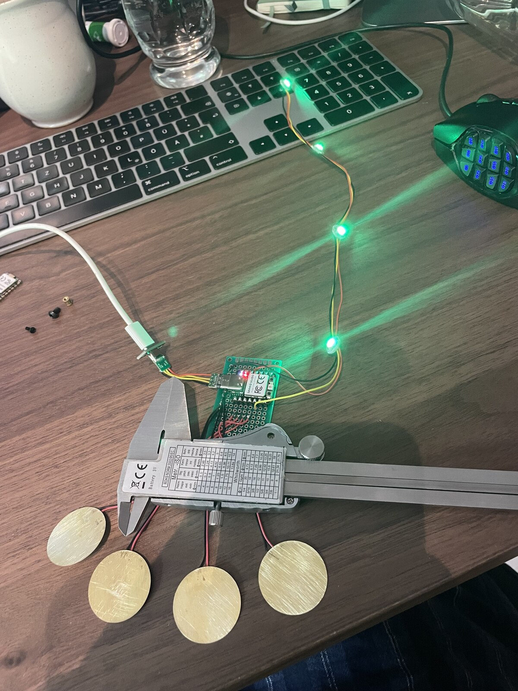
  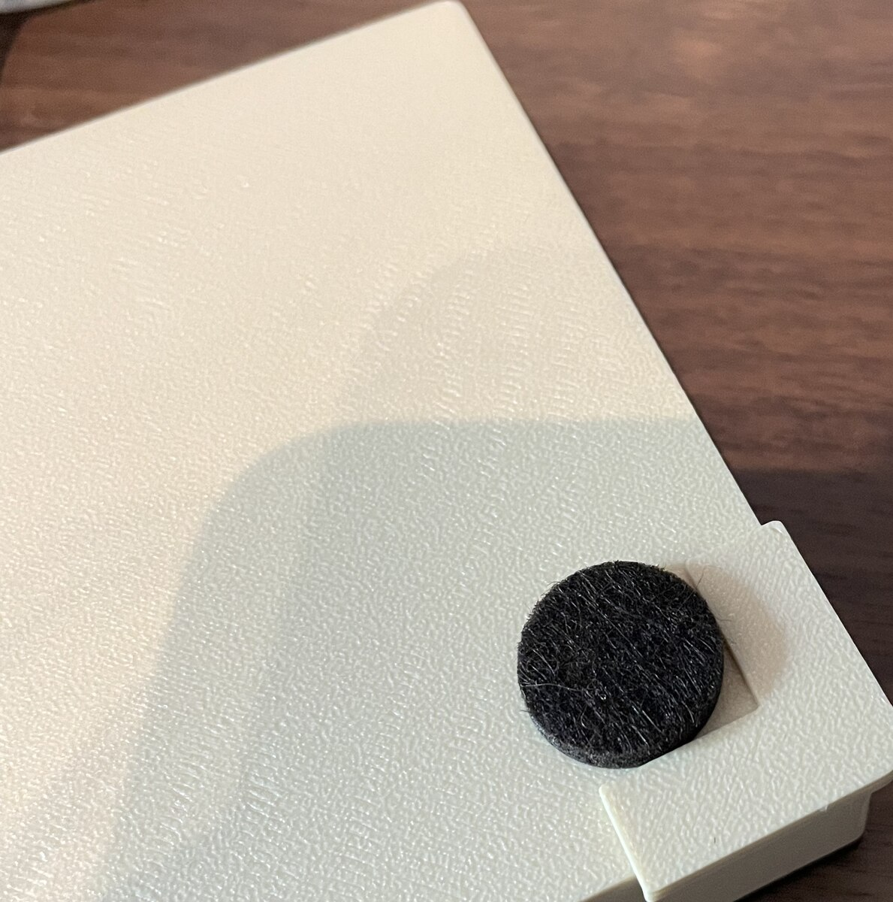
</p>

Feet: felt/rubber pads glued onto the bottom, using the `feet_spacer.stl` to align them.

## Flashing the firmware

The firmware is in [`firmware/`](firmware) as a PlatformIO project (VS Code + PlatformIO extension, or the CLI — either works).

```
cd firmware
pio run              # build
pio run -t upload    # flash to the XIAO RP2040
```

It's straight Arduino framework + `Adafruit_TinyUSB` for the USB MIDI device, `FortySevenEffects/MIDI Library` for the MIDI layer, and `Adafruit NeoPixel` for the LEDs — all pulled automatically by PlatformIO, nothing to install by hand.

`firmware/src/main.cpp` is commented properly — thresholds, timing windows, the combo/hold state machine, all of it. If you're going to tune it for your own build (and you probably will, piezos are a little inconsistent), start there.

## How to play it

### One combo, one note

Every combination of the 4 keys — 15 in total — maps to one note in a 2-octave scale. Hit one key, or several at once, and you get **a single note**, not a chord (you could probably write new firmware and turn this into a chord machine of sorts). 

| Keys pressed | Scale step | Note in C major (default) |
|---|---|---|
| 1 | Root | C |
| 2 | 3rd | E |
| 1+2 | 2nd | D |
| 3 | 5th | G |
| 1+3 | 9th | D (+1 oct) |
| 2+3 | 4th | F |
| 1+2+3 | 11th | F (+1 oct) |
| 4 | 7th | B |
| **1+4** | **Octave** | **C (+1 oct)** — the "landmark" combo, outer two keys together |
| 2+4 | 10th | E (+1 oct) |
| 1+2+4 | 12th | G (+1 oct) |
| 3+4 | 6th | A |
| 1+3+4 | 13th | A (+1 oct) |
| 2+3+4 | 14th | B (+1 oct) |
| 1+2+3+4 | 15th | C (+2 oct) — everything at once, top note |

Velocity is dynamic — hit soft for quiet notes, hit hard for loud ones, curved so a light tap doesn't get buried near-silent.

### LED feedback

Each key's LED lights up when it's part of a struck combo, in a colour that encodes the *shape* of what you hit (not the pitch):

- **White** — single key
- **Blue** — adjacent pair (1+2, 2+3, 3+4)
- **Turquoise** — skip-one pair (1+3, 2+4)
- **Green** — 1+4, the octave landmark
- **Purple** — adjacent triple
- **Orange** — gapped triple
- **Red** — all 4 at once

Brightness scales with how hard you hit.

### Holding notes

Hold a combo down and the note sustains. Hit *anything*, same keys, different keys, whatever while a note's held, and it cuts the old note and starts the new one immediately, so you can play at tempo without waiting for a release to resolve first. But the new one still has to sit through the `PLAY_CHORD_WINDOW_MS` (45ms) before it actually fires, since that's how long the engine needs to see which keys you just hit. So back-to-back notes can't land much closer than 
~45ms apart, no matter how fast your fingers are.

### The menu

Tap all 4 keys together, **twice in a row** (within about 1.5 seconds) to open the settings menu. Same gesture closes it again — or wait a few seconds for the menu to close automatically.

> **The menu hack:** The most reliable way to land a clean all-4-key hit is to just smack the table near the unit twice — the thump travels through the case and triggers all 4 piezos at once. Deliberately hitting all 4 keys with your fingers at the same time is annoyingly hard; whacking the desk is not. Use this to your advantage.

Once in the menu, it uses a similar combo mechanic as playing — layer 1 picks a category per single key, layer 2 picks a value using the key combos laid out below. It auto-exits after 6 seconds of no input, and every change gets saved to flash immediately, so it survives a power-off.

**Layer 1 — pick a category (single key, LED shows category colour):**

| Key | Category | LED colour |
|---|---|---|
| 1 | Root note | Red |
| 2 | Scale | Blue |
| 3 | Transpose | Green |
| 4 | *(reserved, not assigned yet)* | Dim white |

**Layer 2 — Root** (chromatic, 12 combos):

| Keys | Note |
|---|---|
| 1 | C |
| 1+2 | C#/Db |
| 2 | D |
| 2+3 | D#/Eb |
| 3 | E |
| 3+4 | F |
| 4 | F#/Gb |
| 1+4 | G |
| 1+3 | G#/Ab |
| 2+4 | A |
| 1+2+3 | A#/Bb |
| 1+2+4 | B |

**Layer 2 — Scale:**

| Keys | Scale |
|---|---|
| 1 | Major |
| 1+2 | Natural Minor |
| 2 | Dorian |
| 2+3 | Mixolydian |
| 3 | Harmonic Minor |
| 3+4 | Melodic Minor |

**Layer 2 — Transpose:**

| Keys | Transpose |
|---|---|
| 1 | −1 octave |
| 2 | −0.5 octave |
| 3 | +0.5 octave |
| 4 | +1 octave |
| 2+3 | Reset (0) |
| 1+3 | −1.5 octave |
| 1+2 | −2 octave |
| 2+4 | +1.5 octave |
| 3+4 | +2 octave |

Selecting a new value blinks it twice to confirm, then drops you back to layer 1.

Key 4's category slot at layer 1 is currently unassigned — reserved for a future setting (maybe MIDI channel select). Pressing it in the menu does nothing right now.

## Prototyping sketch

[`prototyping/piezo_serial_test.ino`](prototyping/piezo_serial_test.ino) is a plain Arduino IDE sketch, separate from the real firmware. It just reads all 4 piezos continuously and streams the peaks to the Serial Plotter, plus runs a slow RGBW colour-cycle on the LEDs so you can confirm they're wired right. No MIDI, no combo/note logic, nothing clever — flash this first to check your wiring and get a feel for what raw piezo readings actually look like on your specific build before touching the real firmware.

## License

MIT — see [`LICENSE`](LICENSE). Build one, remix it, sell your own version, make sure to tag / show me.

# The End
I hope this was a fun project and you got through with ease. If you're having difficulties at any point, please reach out. You can join my [Discord Server](https://glnnk.art/discord) for support. 
I'd also love to see your creations! Tag me on Instagram or send me a photo to add here.
Check out my other stuff on [YouTube](https://glnnk.art/youtube) or [Instagram](https://instagram.com/glnnk.art).
You can [Buy me a coffee](https://www.paypal.com/paypalme/finnglink) if you've found my work helpful :)
